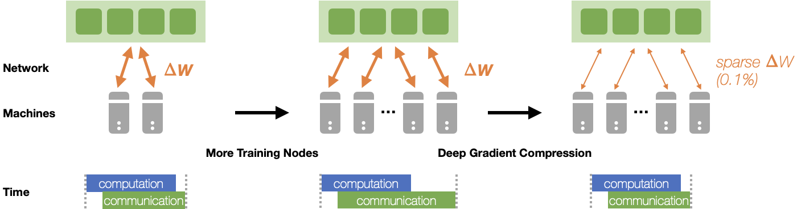
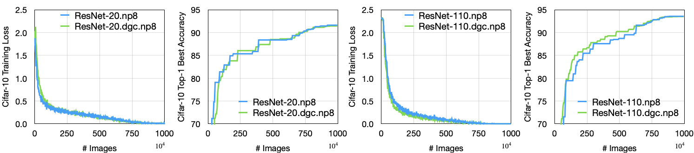
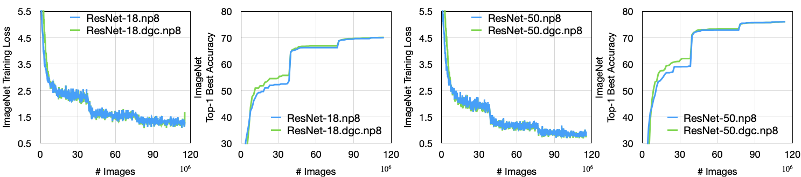
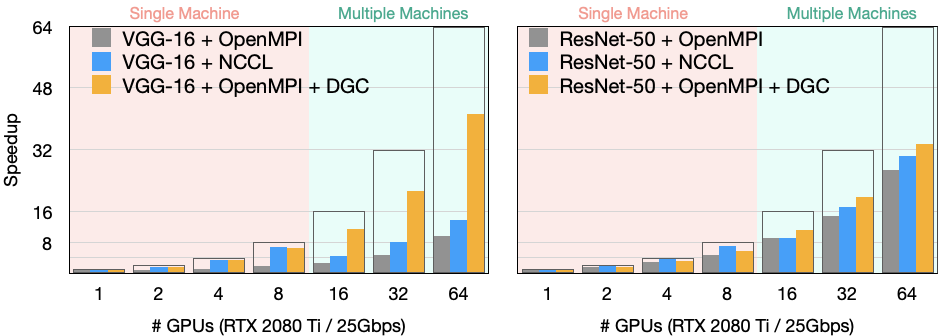

# Deep Gradient Compression [[arXiv]](https://arxiv.org/pdf/1712.01887.pdf)

```
@inproceedings{lin2018dgc,
  title={{Deep Gradient Compression: Reducing the communication bandwidth for distributed training}},
  author={Lin, Yujun and Han, Song and Mao, Huizi and Wang, Yu and Dally, William J},
  booktitle={The International Conference on Learning Representations},
  year={2018}
}
```

## Overview

We release the PyTorch code of the [Deep Gradient Compression](https://arxiv.org/pdf/1712.01887.pdf).

<p align="left">
<br/>
 Figure 1. Deep Gradient Compression (DGC) can reduce the communication bandwidth (transmit less gradients by pruning away small gradients), improve the scalability, and speed up distributed training.<br/><br/>
  

<br/>
 Figure 2. : DGC maintains accuracy: Learning curves of ResNet (the gradient sparsity is 99.9%).<br/><br/>
 
<br/>
 Figure 3. DGC improves the scalability: speedup measured on NVIDIA TITAN RTX 2080Ti GPU cluster with 25 Gbps Ethernet.<br/><br/>
</p>

## Content
- [Prerequisites](#prerequisites)
- [Code](#code)
- [Training](#training)
- [Known Issues and TODOs](#known-issues-and-todos)

## Prerequisites

The code is built with following libraries (see [requirements.txt](requirements.txt)):
- Python >= 3.7
- [PyTorch](https://github.com/pytorch/pytorch) >= 1.5
- [Horovod](https://github.com/horovod/horovod) >= 0.19.4
- [numpy](https://github.com/numpy/numpy)
- [tensorboardX](https://github.com/lanpa/tensorboardX) >= 1.2
- [tqdm](https://github.com/tqdm/tqdm)
- [openmpi](https://www.open-mpi.org/software/ompi/) >= 4.0

## Code

The core code to implement DGC is in [dgc/compression.py](dgc/compression.py) and [dgc/memory.py](dgc/memory.py).

- Gradient Accumulation and Momentum Correction
```python
    mmt = self.momentums[name]
    vec = self.velocities[name]
    if self.nesterov:
        mmt.add_(grad).mul_(self.momentum)
        vec.add_(mmt).add_(grad)
    else:
        mmt.mul_(self.momentum).add_(grad)
        vec.add_(mmt)
    return vec
```

- Sparsification
```python
    importance = tensor.abs()
    # sampling
    sample_start = random.randint(0, sample_stride - 1)
    samples = importance[sample_start::sample_stride]
    # thresholding
    threshold = torch.min(torch.topk(samples, top_k_samples, 0, largest=True, sorted=False)[0])
    mask = torch.ge(importance, threshold)
    indices = mask.nonzero().view(-1)
```

## Training
We use [Horovod](https://github.com/horovod/horovod) to run distributed training:
- run on a machine with *N* GPUs,
```bash
horovodrun -np N python train.py --configs [config files]
```
e.g., resnet-20 on cifar-10 dataset with 8 GPUs:
```bash
# fp16 values, int32 indices
# warmup coeff: [0.25, 0.063, 0.015, 0.004, 0.001] -> 0.001
horovodrun -np 8 python train.py --configs configs/cifar/resnet20.py \
    configs/dgc/wm5.py configs/dgc/fp16.py configs/dgc/int32.py
```
- run on *K* machines with *N* GPUs each,
```bash
mpirun -np [K*N] -H server0:N,server1:N,...,serverK:N \
    -bind-to none -map-by slot -x NCCL_DEBUG=INFO \
    -x LD_LIBRARY_PATH -x PATH -mca pml ob1 \
    -mca btl ^openib -mca btl_tcp_if_exclude docker0,lo \
    python train.py --configs [config files]
```
e.g., resnet-50 on ImageNet dataset with 4 machines with 8 GPUs each,
```bash
# fp32 values, int64 indices, no warmup
mpirun -np 32 -H server0:8,server1:8,server2:8,server3:8 \
    -bind-to none -map-by slot -x NCCL_DEBUG=INFO \
    -x LD_LIBRARY_PATH -x PATH -mca pml ob1 \
    -mca btl ^openib -mca btl_tcp_if_exclude docker0,lo \
    python train.py --configs configs/imagenet/resnet50.py \
    configs/dgc/wm0.py
```
For more information on horovodrun, please read horovod documentations.

You can modify/add new config files under [configs](configs) to change training settings. You can also modify some trivial configs in the command:
```bash
python train.py --configs [config files] --[config name] [config value] --suffix [suffix of experiment directory]
```
e.g.,
```bash
horovodrun -np 8 python train.py --configs configs/cifar/resnet20.py \
    configs/dgc/wm5.py --configs.train.num_epochs 500 --suffix .e500
```

Here are some reproduce results using **0.1%** compression ratio (*i.e.*, `configs.train.compression.compress_ratio = 0.001`):
| #GPUs | Batch Size | #Sparsified Nodes | ResNet-50 | VGG-16-BN | LR Scheduler |
|:-----:|:----------:|:-----------------:|:---------:|:---------:|:------------:|
| -     | -          | -                 |  [76.2](https://pytorch.org/docs/stable/torchvision/models.html) | [73.4](https://pytorch.org/docs/stable/torchvision/models.html) | - |
| 8     | 256        | 8                 |   76.6    |   74.1    | MultiStep    |
| 16    | 512        | 16                |   76.5    |   73.8    | MultiStep    |
| 32    | 1024       | 32                |   76.3    |   73.3    | MultiStep    |
| 32    | 1024       | 32                |   76.7    |   74.4    | Cosine       |
| 64    | 2048       | 64                |   76.8    |   74.2    | Cosine       |
| 64    | 2048       | 8                 |   76.6    |   73.8    | Cosine       |
| 128   | 4096       | 16                |   76.4    |   73.1    | Cosine       |
| 256   | 8192       | 32                |   75.9    |   71.7    | Cosine       |

## Known Issues and TODOs

- **Backend**: We currently only support OpenMPI backend. We encountered some errors when calling `allgather` using NCCL2 backend: `allgather`ed data are random data once in a while; if we set `CUDA_LAUNCH_BLOCKING=1` for debugging, everything works well.
- **#Sparsified Nodes**: We currently treat each GPU as an independent node. However, communication is rarely a bottleneck within one machine. A better strategy should be performing `allreduce` dense gradients intra-machine and `allgather` sparse gradients inter-machines. 
  - For accuracy/convergence verification, we can simulate this by setting `configs.train.num_batches_per_step` to desired #GPUs per machine (see accuracy table for batch size = 4096/8192).
- **Sparsification Granularity**: We naively perform fine-grained (*i.e.*, element-wise) top-k to select gradients, and thus the communication will suffer from increased `allgather` data volume as #nodes increases.
  - [Sun *et.al.*](https://arxiv.org/pdf/1902.06855.pdf) modified the process with coarse-grained sparsification: gradients are partioned into chunks, `allreduce` the gradient chunks selected based on `allreduce`d L1-norm of each chunk, which gets rid of the `allgather` and solves the problem.
- **Data Encoding**: We did not perform any data quantization/encoding before transmission. Data encoding can further reduce data volume.
- **Overhead**: Performing sparsification (esp. adapting thresholding) in C/C++ may further reduce the DGC overhead.

## License

This repository is released under the Apache license. See [LICENSE](LICENSE) for additional details.


## Acknowledgement
- Our implementation is modified from [grace](https://github.com/sands-lab/grace) which is an unified framework for all sorts of compressed distributed training algorithms.
